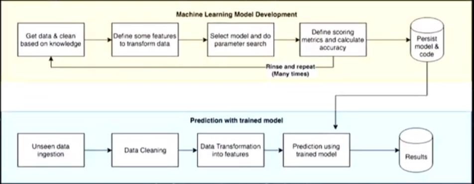
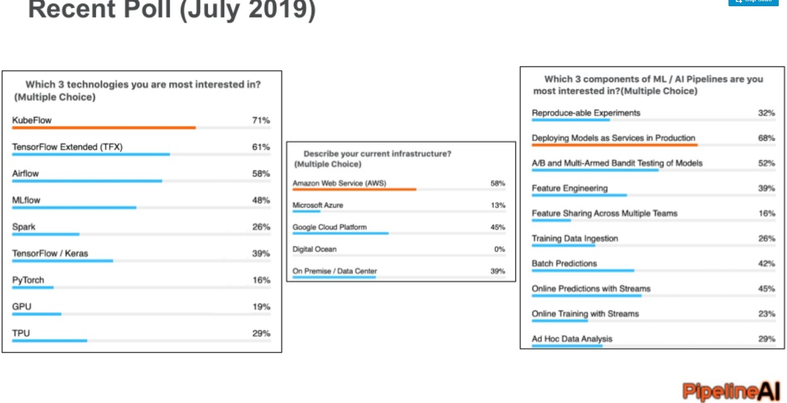
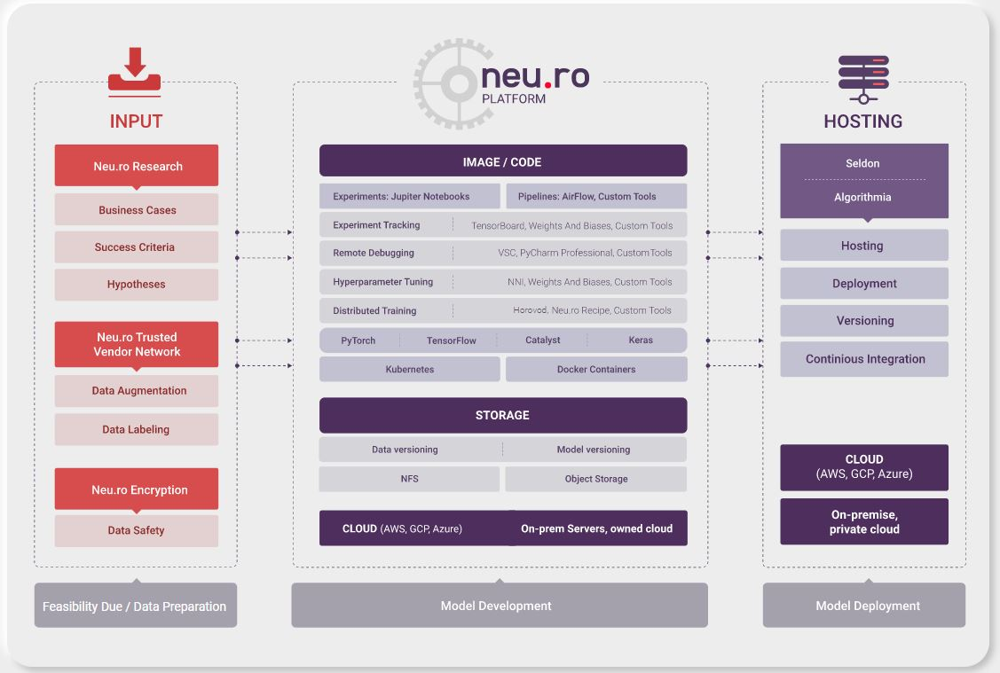

# Production machine learning system| Real World ML System | Enterprise AI Platform MLOps 
This repository intends to offers 
- A Real-world *vision and recipe* of the `design, development and operation` of **production machine learning systems & operation**.
- A curated list of tools, frameworks and open source libraries that helps AI/ML Engineers `Deploy, monitor, version, scale, and secure` production machine learning. 
- A *Recipe/prescription* of constituents, constructs and tools for to build & opertaionize a **comprehensive, operational & production Machine learning ecosystem** .Any good **Enterprise AI Platform** must intend to stich/chain together these constructs and tools under its hood. Genrally 'Enterprise AI Platforms', such as ```H20.ai, Alteryx, HopsML, Neu.ro, PipelineAI, DataRobot ``` etc, are powered by **Custom MLOPS** with the objective to *attempt to offer* essential high level MLOps constructs.
- A Deep Dive View into:
    - ML Model Reproducitbility and Versioning
    - Production Machine Learning Orchestration
    - Explainablility of Black Box Models (a pillar of AI Trust)
    - **Ethical AI (a pillar of AI Trust)** with adequate deatiling around ```Ethical AI Frameworks, Codes of Ethics, Guidelines, Regulations``` et al. [Ethical AI](/README_Ethical_AI.md).
- Target Audience:
	- Entereprise Architects / AI ML Solution Architects
	- AI Researcher 
	- Data Scientists
	- AI/ML Engineers
	- AI Platform Engineers
	- DevOps Engineers

***
**A Quick Rundown:**

- [INSPIRATION for MLOPS](#INSPIRATION_for_MLOPS)
     - [WHY DO WE NEED MLOPS?](#WHY-DO-WE-NEED-MLOPS)
		- [EVOLUTION JOURNEY IN AI MATURITY CURVE](#EVOLUTION-IN-AI-MATURITY-JOURNEY)
		- [INDUSTRY SURVEY](#INDUSTRY-SURVEY)
		- [HIDDEN TECH DEBT IN REAL WORLD ML SYSTEM](#HIDDEN-TECH-DEBT-IN-REAL-WORLD-ML-SYSTEM)
- [MLOPS VS DATAOPS VS AIOPS VS PLATFORMOPS](#MLOPS-VS-DATAOPS-VS-AIOPS-VS-PLATFORMOPS)
- [STATE OF MACHINE LEARNING OPERATIONS IN Y2019](#STATE-OF-MACHINE-LEARNING-OPERATIONS-IN-Y2019)
- [MLOPS Reference Architecture](#MLOPS-Reference-Architecture)
- [High level constructs of MLOPS](#High-level-constructs-of-Real-World-MLOPS)
- [Detail References to the Constructs and Tools of MLOPS](#Detail-References-to-the-Constructs-and-Tools-of-MLOPS)
- [MLOPS Architecture based on KUBEFLOW](#MLOPS-Architecture-based-on-KUBEFLOW)
- [Deep Dive into AI/ML SECURITY](#Deep-Dive-into-AI-SECURITY)
- [Product Machine Learning System Y2019 A Video](#Product-Machine-Learning-System-Y2019-A-Video)
***

# INSPIRATION for MLOPS

## WHY DO WE NEED MLOPS**

Three Pronged Answer 
***
```
	
	- EVOLUTION JOURNEY IN AI MATURITY CURVE
	         {AS the Organizations advance in their AI Maturity journey, complexities start growing expoenentially}
	
	- HIDDEN TECH DEBT IN REAL WORLD ML SYSTEM 
	         {by _Google NIPS 2015}
		 
	- STATE OF MACHINE LEANRNING OPERATIONS IN Y2019 
	         {Survey conducted by PipelineAI in July 2019 on State of Machine learning Operations}
	
	The aforementioned pointers are explained in below segments.
```
### INDUSTRY SURVEY

But, before we resort to a deep dive into these aforementioned 3 PRONGED answers, Let us have a sneak peek into couple of the *interesting suerveys* conducted - 

A. "Only 20% of ML Models in the enterprise making into the production environments"
    _ [from 3073 AI Aware CXO-level executive surveyed](https://www.activestate.com/wp-content/uploads/2018/10/webinar-slides-mlops.pdf) 
    
B. The Story of Enterprise Machine Learning: "It took me 3 weeks to develop the model. It has been > 11 months, and it's still not deployed."
    _ [Ref Source: The Linux foundation CD.FONDATION](https://cd.foundation/blog/2020/02/11/announcing-the-cd-foundation-mlops-sig/)
   
C. [The State of Affairs in MACHINE LEARNING OPERATIONS- Y'2019 Survey](#STATE-OF-MACHINE-LEARNING-OPERATIONS-IN-Y2019)


***
### EVOLUTION IN AI MATURITY JOURNEY

- ***AS the Organizations advance in their AI Maturity journey, complexities start growing expoenentially.***
- ***SMALL DATA SCIENCE PROJECTS/DataScience POC/MVP* has lesser complexities, than the *ENTERPRISE DATA SCIENCE SYSTEM***.


Let us have a sneak peek into the Journey of any Org through various stages of AI Maturity, and related complexities
```
"THE BEGINERS LUCK" (stage 1)

         -->  "WHEN THE RUBBER HITS THE ROAD" (stage 2) 
	 
                   --> "THE PROLIFERATION" (Stage 3)
```
 -- *[STAGE 1.]*  **'THE BEGINERS LUCK STAGE** 

A *Simple ML workflow* does relatively very well with *SMALL DATA SCIENCE PROJECTS/POC/MVP*
``` 'Build/Prepare' --> 'Train' --> 'Evaluate'--> 'Deploy' --> 'UI' (a simple WebApp) ```

As the focus is 
   - Focus is on the deployment of the Model (accepted with success criteria), 
   - Enable the registry of its inference in Real time,
   - Enable a simple PWA UI for the Visualization.
    
THEREFORE, the SIMPLE WORKFLOW which worked pretty well for 'SMALL DATA SCIENCE PROJECTS' starts failing and crumbling under the complexities of 'ENTERPRISE DATA SCIENCE SYSTEM'.


-- *[STAGE 2.]* **'WHEN THE RUBBER HITS THE ROAD' SATGE**

As and when, the SMALL DATA SCIENCE PROJECTS/POC/MVPPOC/MVP hits the REAL WORLD SYSTEM, it starts facing new set of Challenges, and focus shifts to following

- **Need to Re-Train**: After Pushing Your Model to Production, Your Model is already Out of Date. Google updates its SEO model/algorithm  on average 500 times per year. [Ref](https://www.seoblog.com/google-penguin-panda-refresh/#:~:text=Of%20course%2C%20these%20are%20not,average%20500%20times%20per%20year.)

- **Slow**: Need to Quantize and Speed Up Predictions

- **Biased**: Needs to Validate Trained ML Binary/ Service/ servable in any form for Bias detection Before Pushing 

- **AI/ML Service Routing (If Broken)**: Need to A/B Test/ Multi Armed Bandit in Production 

- **Security Vulnerability (If Hacked)**: Need to Train With Data Privacy (All your Data & other security is for a toss now as the Makert exposed AI Model has the essence of the underlying data.

- **Monitoring performance of the model** due to Data drift & concept drift


A *Slightly Matured Workflow* does the work - 
 ```'Build/Prepare' --> 'Train' --> 'Evaluate'--> 'Deploy' --> 'UI' (a PWA WebApp)** --> 'Monitor' --> Retraining pathway ```

|**SMALL/MID SIZE DATA SCIENCE PROJECTS**| **ENTERPRISE DATA SCIENCE SYSTEM**|
| :---: | :---:|
| Workflow | Workflow| 
|||
| Workflow Job well done | Still lot missing in the Workflow :smiley:| 

 -- *[STAGE 3.]* **'THE PROLIFERATION' STAGE**

But, as the Data Science (DS) requirements, demand for DS productionization, multiple DS Teams grows, whole lot of new issues starts popping up in explonential manner for large **ENTERPRISE DATA SCIENCE SYSTEM**. Such as,

- Heterogeneity and Scale PROLIFERATION
     - Possibly differing engines proliferation (Spark, TensorFlow, Caffe, PyTorch, Sci-kitLearn, etc.). Multiple siloed DS Team would start using their own preferred DS tools.
     - Different languages proliferation (Python, Java, Scala, R ..)
     - Different Inference vs Training engines
		- Training can be frequently batch
		- Inference (Prediction, Model Serving) can be REST endpoint/custom code, streaming engine, micro-batch, etc.
     - Feature manipulation done at training needs to be replicated (or factored in) at inference 
     - Each engine presents its own scale opportunities/issues
  
- Increased complexities in flow of Data (One Centralized DataLake team, and multiple DS Team clamouring) 
	- ML Team heavy dependence on data team for multiple data dimensions @variety, @Veracity, @Volume and @variability 
  
- Serving Models become increasingly harder 
	- multiple DS Team, 
	- multiple DS Tools, 
	- multiple Serving requirements
 
- Infrastructure needs, its governance complexities starts growing rapidly 
 	- Mutiple SERVING requirements, 
	- Mutiple TRAINING requirements, 
	- Mutiple DATA processing requirements, 
	- Mutiple VISUALIZATION requirements etc 
	*@varied frequency, @varied technologies, @varied Infra types**
 
- when stuff goes wrong it's hard to trace back, 

- Compliance, Regulations…
	- Model Risk Management in Financial Services
	- GDPR on Reproducing and Explaining ML Decisions
	- Fairness Monitoring

- & many More (See, whole lot of issues large Enterprise starts facing @exponential rate!!)

A Fully Matured Custom MLOPS workflow is required to handle challenges of large *ENTERPRISE DATA SCIENCE SYSTEM*.

**MLOPS IS THE SILVER BULLET!**
***

***
### HIDDEN TECH DEBT IN REAL WORLD ML SYSTEM

<p align="center"> # HIDDEN TECH DEBT IN ML SYSTEM- NIPS/GOOGLE 2015</p> 

<p align="center"> # Only a SMALL FRACTION of REAL-WORLD ML SYSTEMs is composed of the ML CODE</p> 

_Courtsey Google NIPS 2015

<p align="center">

</p>

<p align="center">[HIDDEN TECH DEBT IN ML SYSTEM- NIPS/GOOGLE 2015](https://papers.nips.cc/paper/5656-hidden-technical-debt-in-machine-learning-systems.pdf)</p>  


<p align="center"> # Hardest part of AI isn't AI, but it's Data & productionization</p> 

<p align="center"> # Productionization/Industralization Machine Learning Systems</p> 
    
**MLOPS IS THE SILVER BULLET!**
***

***

# MLOPS VS DATAOPS VS AIOPS VS PLATFORMOPS

DevOps fits everywhere in IT landscape  as like salt. Infact, DevOps dons multiple avataar in the broader perspective of Enterprise AI & Data  Platform landscape -  

- **MLOps** is the application DevOps for AI, ML & Analytics foundation for to help Data Scientists in managing ML Lifecycle (building-training-deployment-Inferenece-monitroing-Trust lifecycle). I.e., MLOps is the practice of applying DevOps to help automate, manage, and audit machine learning (ML) workflows.
“MLOps (a compound of “machine learning” and “operations”) is a practice for collaboration and communication between data scientists and operations professionals to help manage production ML (or deep learning) lifecycle". – Wiki
```	
	- MLOps = f(CI, CD, CT, CS, uS) in AI/ML field
		- CI == Continuous Integration of entire solution blocks in E2E ML Lifecycle
		- CD == Consistent deployment of entire solution blocks in E2E ML Lifecycle
		- CT == Continuous retraining & serving (deployment as AIaaS, binary, pruned end point) pathway for entire solution blocks in E2E ML Lifecycle
		- CS == Continuous Data pipeline for Real-time/Batch/Microbatch for Inference/Scoring of the model in production
		- uS == Microservice governance of entire solution blocks in E2E ML Lifecycle
		
		New generation MLOPS is composed of DataOps as well. :)
```
- **DataOps** is the application DevOps for data foundation for to help Data Engineers in managing Data Lifecycle. 
DataOps is a collaborative data management practice focused on improving the communication, integration and automation of data flows between data managers and data consumers across an organization. -Gartner
```
	- DataOps = f(CI, CD, CO, uS) in Data Engineering field
		- CI == Continuous Integration of entire solution blocks in Data Engineering Lifecycle
		- CD == Consistent deployment of entire solution blocks in Data Engineering Lifecycle
		- CO == Continuous Orachsetration pathway for entire solution blocks in Data Engineering Lifecycle
		- uS == Microservice governance of entire solution blocks in Data Engineering Lifecycle

```
- The term **AIOps** stands for “artificial intelligence for IT operations” Originally coined by Gartner in 2017, the term refers to the way data and information from an IT environment are managed by an IT team–in this case, using AI. It's the application DevOps for for IT operations assited by AI. I.e., ***AIOps == AI powered ITOps***
```
	- AIOps = f(CI, CD, SIEM, uS) in Infrastructure Monitoring & Management field
		- CI == Continuous Integration of entire solution blocks in IT operations Lifecycle
		- CD == Consistent deployment of entire solution blocks in IT operations Lifecycle
		- SIEM == SIEM (Security Information and Event Management) pathway
		- uS == Microservice governance of entire solution blocks in IT operations Lifecycle
```
- **PlatformOps** - Any Enterprise Platform is driven by PlatformOps for Building-Rolling_upgrade-Deployment of Platform in customer’s preferred choice of Infrastructure in accelerated fashion with ‘consistent deployment’ theme. 


# STATE OF MACHINE LEARNING OPERATIONS IN Y2019

Survey conducted by PipelineAI in July 2019: State of Machine learning Operations -
 

**Custom MLOPS IS THE SILVER BULLET!**
***


# High level constructs of Real World MLOPS

Any **"Enterprise Data Science System" / "Enterprise AI Platform"** must intend to stich/chain together at least the essential & high level constructs of MLOPS under its hood. Genrally "Enterprise AI Platform", such as H20.ai/Alteryx/HopsML/PipelineAI etc are powered by **Custom MLOPS** with the objective to *attempt to offer* following key high level AI/ML constructs:
		- [AI ML Dataset Annotation](#AI-ML-Dataset-Annotation)
		- [AI ML Pipeline](#AI/ML-Pipeline)
		- [Automated ML](#Automated-ML)
		- [Comprehensive AI Governance](#Comprehensive-AI-Governance)
		- [ML Operation COST Optimization SERVERLESS MLOPS](#ML-Operation-COST-Optimization-SERVERLESS-MLOPS)
		- [Data and AI CI CD Operations](#Data-and-AI-CI-CD-Operations)
		- [Comprehensive Data Operations DataOps](#Comprehensive-Data-Operations-DataOps)

#### AI ML Dataset Annotation
    ```
     --o 'Image Annotation framework' (VoTT, LabelImg, VIA ) 
     --o 'NLP/ Text Annotation framework' (spacy, explosion.ai,)
     --o 'Audio & Speech Annotation framework' (Web-Based Audio Sequencer, CrowdCurio/audio-annotator, annotationpro)
     --o 'Ontology/Knowledge Graph Annotation framework' (Apache Jena)
     ```
          
#### AI ML Pipeline 
    ```
     -->  'Build/Prepare' - A Notebook/ Visual AI Studio with dockerized support for underlying
     		- AI/ML Libraries (e.g., TF/PyTorch/SparkML/XGboost/0
		- EDA libraries, 
		- Pre-processing libraries, such as 
			- Data Augmentation Libraries, 
			- Adversarial Robustness Libraries,
			- Translational/Angular variance et al.  
			
     --> 'Train' - Computation load distribution frameworks for '
     		
		- Distributed Training (e.g., using Horovod or Sonner or custom template)
		- Standalone tarining
		- with support for real time Training Visualization(e.g., TensorBoard/VisualDL)
		- on accelerated neural network hardware NVIDIA GPU/Google TPU/CPU with the leverage of NVIDIA GPU-accelerated libraries (CUDA, CuDNN) 
		
     --> 'Evaluate'
     
     --> 'Model Serialization & Quantization' (e.g.,Using TF-Serving, ONNX Runtime, Seldon Core et al)
     		- Serializaion support for Protobuff, hdf5, pickle et al
		- Serialization interoperability
		- Model binary/servable quantization & Pruning
     
     --> 'Deploy' 
                - AI-as-a-Service -RESTful/gRPC API, or, 
		- Binary Servables, or, 
		- Edge deployment,
		- Mobile deployment
		- model versioning for model updates (with "Rollback option" to previous version)
		
     --> 'AI Inference Service Routing' (e.g.,'Service Mesh' like Istio)
     
     --> 'Monitor' (Data drift & Concept drift with Alert) 
     
     --> 'Automated Re-training pathway' (e.g., ORACHESTRATOR - Apache Airflow, Kubeflow-pipeline, Databricks MLFlow, Apache Beam)
     
     --> 'User Interface' (PWA/ MobileApp / Web App)
    ```
    
#### Automated ML 
    ```
      'HPO' - Hyper Parameter Optimization,
      'Randmoized/Grid Serach',
      'NAS' - Neural Architecture Search,  
      'AutoML'         
    ```

#### Comprehensive AI Governance
    ```
     --o 'AI TRUST' 
     		- Explainable AI, 
		- Ethical AI, 
		- Fair AI, 
		- Feature Management & Stoarge, 
		- Dataset processing transformation persistence,
		- Model and Data Versioning,
     
     --o 'AI Collaboration, Sharing & Exchange' 
                Authenticated, Authroized and Logging based Market place for sharing & exchange of MODELS and Model related artefacts
		- AI/ML APIs, 
		- Fature Set, 
		- Training metrics,
		- Model Binaries, 
		- Notebook /Model Code,
     
     --o 'AI Security' 
     		- Privacy Preserving Machine Learning
			- Differntial Privacy (offered by libraries such as Tensorflow Privacy)
			- ε-differentially private algorithms (Google's Differential Privacy)
			- Homomorphic Encryption / Data privacy in Real World AI/ML system (Intel n-Graph with Tensorflow, or, Microsoft SEAL)
		- AI/ML API Security 
			- AI/ML RESTful or gRPC end point Authentication & Authorization
			- AI/ML Federated User Pool & Identity Pool management (FIdM/ FIM)
			- DevSecOps (Security as Code) for AI/ML Application devleopment, deployment, monitoring, 
     
     --o 'AI Scalability' 
      		- Autoamted Load Balancing, 
		- Service Routing, AutoScaling, 
		- MultiZone Replication, 
		- Caching
     
     --o 'AI Inference Model Update/ Roll out' Mechanism 
            	- Blue Green Deployment
	        - Canary Deployment 
	        - Multi Armed Bandit Deployment
	        - A/B
      
    ```

#### ML Operation COST Optimization SERVERLESS MLOPS
     ```
 
      --o 'Serverless Framework' 
      			- FaaS: Apache OpenWhish/ OpenFaas,  
			- KNative
      
      --o 'Hybrid Computing/ processing' 
                    - Local Edge Processing (EdgeX/AWS Greegrass Core/Azure IoT Core/GCP IoT Core)
		    - Centralized Cloud Processing (AWS/Azure/GCP)
      
      --o 'Modular Plug & Play of AI/ML system' leveraging 
      		   - Microservice (uS) governance framework' [API Gateway, uS Service Mesh, Automated uS Service Discovery & Registry, uS Service Config, uS service internal communication protocol etc]
      		   - Containerization & CaaS (Docker, Kubernetes)
     --o Optimized calculation frameworks (cuDF/ cuML)
      
     ```            
 
#### Data and AI CI CD Operations 
     ```
     o 'REQUIREMENT & AGILE COLLABORATION TOOLS' (Jira/ Confluence)
     o 'SCM TOOLS (GIT - GitHub/GitLab)
     o 'CI ENGINE' (Jeknis/ Travis CI)
     o 'BUILD TOOLS' (Maven/ Grunt / Wheel)
     o 'UNIT TESTING TOOLS' (PyTest/ JUnit / Mocha / Jasmine) 
     o 'CODE COVERAGE TOOLS' (SonarQube)
     o 'CD PIPELINE/FRAMEWORK- 1' ( Ansible/ Chef / Puppet)  
     o 'ARTEFACT REPOSITORY MANAGER TOOLS' (Nexus/ Artefactory)
     o 'FUNCTIONAL TESTING TOOLS' ('Selenium')
     o 'SECURITY SCAN TESTING (SAST/DAST) TOOLS' (CheckMarx/ Fortify / BalckDuck)
     o ''CD PIPELINE/FRAMEWORK- 2' Containerized & Container orachasteration by Container-as-a-Service ' (Containerization - Docker, CaaS -Kubernetes, IaC - Terraform) 
      ```       
 

#### Comprehensive Data Operations DataOps 
  ```
      --o 'Data pipelines & ETL'
      --o 'Data Stream Processing' 
      --o 'Data storage & Optimization'
      --o 'Data Intertcive Querying Interface'
      --o 'Data TRUST'      
   ``` 

# MLOPS Reference Architecture

MLOPS Reference Architecture from One of visionary AI platform with specialized service offering in MLOPS:


Reference: [Neuomation AI Platform](https://neu.ro/) | Neuromation has a specialized niche Offering in Remote MLOPS.


# Detail References to the Constructs and Tools of MLOPS

**Please note:**

- The below matrix serve as the Index table.
- Please click on hyperlinks of the respective items to delve deep into it.
- Please keep checking your compass (this index table) for to seamlessly steer your way to the next mile of this wonderful matrix.

| | | | |
|-|-|-|-|
| [🧵 Data pipelines & ETL](/README_Data%20Pipeline%20ETL%20Frameworks.md)| [💸 Data Stream Processing](/README_Data%20Stream%20Processing.md) |[🗞️ Data storage](/README_Data%20Storage%20Optimisation.md) |[🏷️ Data Labelling](/README_Data%20Labelling%20Tools%20and%20Frameworks.md)|
| [🌀 Feature engineering](README_Feature%20Engineering%20Automation.md)| [🎁 Feature Stores](/README_Feature%20Stores.md)| [📓 Reproducible Notebooks](/README_Data%20Science%20Notebook%20Frameworks.md)|[🏁 Model Orchestration & Deployment Framework](/README_Model%20Orchestration%20%26%20Deployment%20Frameworks.md)|
| [🗺️ ML Training Computation distribution]() | [📊 ML Training & Indutrial Visualisation frameworks](/README_ML%20Computation%20load%20distribution%20frameworks.md) |[⚔ Adversarial Robustness](README_Adversarial%20Robustness%20Libraries.md) |[📥 Model serialisation](/README_Model%20serialisation%20formats.md) |
|[🔍 Explaining predictions & models](/README_Explaining%20Black%20Box%20Models.md) | [🔏 Privacy preserving ML](/README_Privacy%20Preserving%20Machine%20Learning.md) | [📜 Model & data versioning](/README_Model%20and%20Data%20Versioning.md)| [🧮 Optimized calculation frameworks](/README_Optimized%20calculation%20frameworks.md) |
|[🤖 AutoML](/README_Neural%20Architecture%20Search.md)| [📡 Functions as a service](README_Function%20as%20a%20Service%20Frameworks.md) | [🔠 Industry-strength NLP](/README_Industrial%20Strength%20NLP.md) | [💰 Commercial Platforms](/README_Commercial%20Platforms.md) | 


# MLOPS Architecture by FOSS

### MLOPS Architecture based on KUBEFLOW

- High level conceptual MLOPS solutions orchasterated by KUBEFLOW  (Muliple technology blocks for Enterprise level MLOPS):


													    
- Serverless MLFLOW by amalgamation of KUBEFLOW & KNative:


- Runtime TRAINING Visulization of Deep NN Models supported by Kubeflow leveraging TensorBoard: A Visual of TensorBoard for TRAINING Visualization:


# Deep Dive into AI SECURITY
'AI Security' is now often being discussed a lot, and is increasingly becoming a point of concern as, in a technical parlance, AI/ML model endpoints are been exploited as attack-vector / vulnerability vector. *AI/ML Model endpoint Privacy*  | *Data Privacy in Real World AI/ML System* | *Lack of Comprehensive adoption of DevSecOps Pipeline in Real World AI/ML system* et al.

#### Why AI SECURITY is important
- AI/ML Models are getting deployed on edge devices / edge gateways / Fog devices / Mobiles for offline predictions (owing to rapid proliferation of IIoT/ CIoT) 
	- Agile, Dynamic Security Perimeter of AI/ML Serving end points
- AI/ML Models gets exposed to real data, and inferencing of models can expose sensitive information
- AI/ML Models generally are not trained on Masked data
- AI/ML Model endpoint security (owing to uS Microservice style of AI/ML serving, AI-as-a-Service)
	- AI/ML RESTful or gRPC end point Authentication & Authorization
	- AI/ML Federated User Pool & Identity Pool management (FIdM/ FIM)
- Absence of DevSecOps *(Security-as-a-Code)* implementation pipeline in AI/ML Application productionization- i.e., lack of awareness for 
	- Vulnerability Scanning while Application development, such as *SAST Vulnerability Scanning*
	- Vulnerability Scanning while Application deployment, such as *DAST Vulnerability Scanning*
	- SIEM in production (Continuous Monitoring, Threat detection and alerting, Threat remediation)
	


#### Real World AI Comprehensive SOC Solution
There is comprehensive SOC solution (SOC- Security Operation Control - Plane) for *real world AI/ML*.

Real World AI/ML SOC Plane is a custom solution, and is composed of following solution components primarily:

- Privacy Preserving Machine Learning
	- Differntial Privacy (offered by libraries such as Tensorflow Privacy)
	- ε-differentially private algorithms (Google's Differential Privacy)
	- Homomorphic Encryption (Intel n-Graph with Tensorflow, or, Microsoft SEAL)
{P.S.: Homomorphic encryption is a form of encryption that allows computation on encrypted data, and is an attractive remedy to increasing concerns about *data privacy in the field of machine learning*.}	
	
- AI/ML API/Endpoint Security 
	- AI/ML RESTful or gRPC end point Authentication & Authorization
	- AI/ML Federated User Pool & Identity Pool management (FIdM/ FIM)

- Implementation DevSecOps (Security-as-Code) pipeline for AI/ML Application development, deployment, monitoring, Threat detection and alerting, Threat remediation
	- Please refer to my another repo [DevSecOps Sec-as-a-Code]() for delving deeper into the awesome world of DevSecOps.
     


# Product Machine Learning System Y2019 A Video

<table>
  <tr>
    <td width="30%">
        This <a href="https://www.youtube.com/watch?v=Ynb6X0KZKxY"> VIDEO </a> provides an overview of the motivations for machine learning operations as well as a high level overview on some of the tools in this repo.
    </td>
    <td width="70%">
        <a href="https://www.youtube.com/watch?v=Ynb6X0KZKxY"></a>
    </td>
  </tr>
</table>


||
|:--:|
|Refer to my another Repo for [DevOps Operations for ML Deep Reinforecment Learning](https://github.com/DeepHiveMind/gateway_to_DeepReinforcementLearning_DeepNN)|
|Refer to my another Repo for [DevOps Operations for Blcokchain Hyperledger Fabric](https://github.com/DeepHiveMind/gateway_to_DeepReinforcementLearning_DeepNN)|
